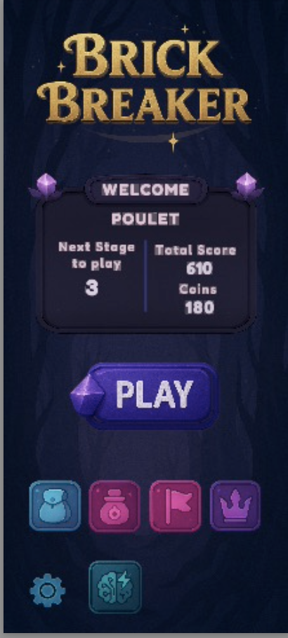

# Brick Breaker

## Description  
Ce projet, inspiré du célèbre jeu **Brick Breaker**, est une excellente occasion de plonger dans le développement d'applications mobiles.  
Vous apprendrez à concevoir une interface utilisateur attrayante, à gérer l’inscription et les informations des utilisateurs, à implémenter les fonctionnalités clés du jeu, et à maîtriser les techniques propres au développement sur appareils mobiles.  
Ce projet vous permettra de transformer une idée en une application mobile fonctionnelle, tout en vous dotant de compétences essentielles en programmation mobile.

## Technologies  
- Unity 6  
- C#  
- Firebase  

## Aperçu  
[] 

[📄 Voir toutes les images (PDF)](apercu.pdf)
